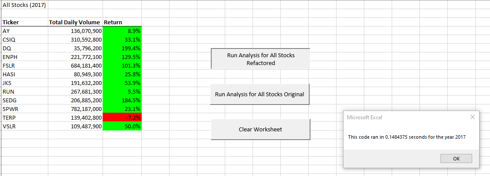
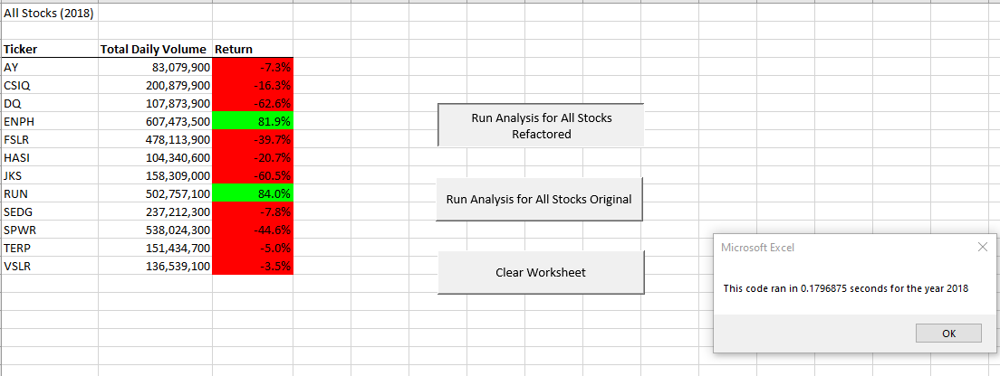
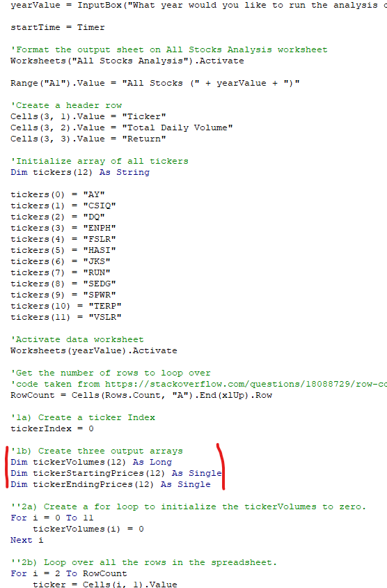

# **VBA of Wall Street**
## **Using VBA for Stock Analysis**
## **Overview**
Steve wanted to get the return for a dozen stocks for a couple of years to determine which stock to invest in. A worksheet was created to help him analyze those stocks with the press of a button. Steve now wants to analyze the entire market over more years. The code used to create the original macro works well but loading more data equates to a longer run time. The original code was refactored to decrease the run time. 
### **Purpose**
The purpose of this analysis is to compare the stock performances between 2017 and 2018 while also comparing the efficiency of the original script to the refactored script.
## **Results**
Image 1 shows 2017 returns for 12 stocks. They all performed well with a positive return except, TERP. DQ outperformed the others with almost a 200 percent return with SEDG close behind. ENPH and FSLR also performed well which puts four stocks with over 100% return for 2017. At the time, 2017 was the 2nd highest performing year in 10 years, so it is expected that most stock would perform well. Given that TERP stock did not, it would probably not be a good investment.

 **Image 1**

However, in 2018, most of the stocks had negative returns (see image 2). There is a massive downturn for all but two stocks. ENPH did not see a massive return as it did in 2017 but it remained one of two top performing stocks behind RUN even though it’s yearly return was lower. For context, 2018 was the lowest yearly return in a decade. RUN was the only stock to have a positive yearly return at nearly 75%. Data suggests that both ENRP and RUN would be good investments. 

 **Image 2**

In the images above, the run time of each year appears. The run time for 2017 and 2018 using the refactored code is 0.15sec and 0.18sec respectively. Both times for the refactored script are about 80% less than the original script. The main difference in these scripta are the arrays. In image 3 of the refactored code more arrays were added. The original only had a ticker array whereas the refactored code had arrays for, volume, starting price, and ending price. Adding additional arrays allowed the script to run faster (see image 3).

**Image 3**

## **Summary**
### **Advantages and Disadvantages of the original and refactored VBA script**
With additional arrays, the script only went through the given worksheet once. It gathered the information for the tickers, volume, starting prices and ending prices for each stock as it went through the appropriate stock data for a given year. After it gathered all the data, it then outputted all the data in the appropriate worksheet. This is the main advantage of the refactored script, while lack of arrays was the main disadvantage of the original script. Only one array of tickers was used. For each array the script went through the worksheet once for a total of 12 times. This makes the script run slower and if more stocks are added it would take about 80% longer to run. Although the refactored code runs faster, it was harder to write and keep track of due to the arrays. 

### **Advantages and Disadvantages of refactoring code in general**
Refactoring code can make the code more efficient and improve the logic just as the refactored code here, did. While both codes worked, the refactored code did one sweep of the sheet as opposed to 12. However, the biggest disadvantage to refactoring code is breaking it or introducing bugs. Like the refactored code here, there will be issues that require debugging to get it to work again.  
 
